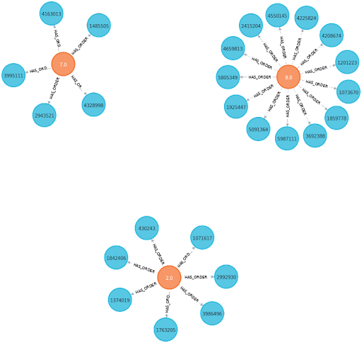
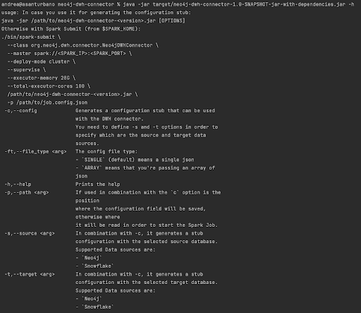
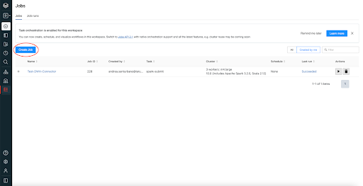
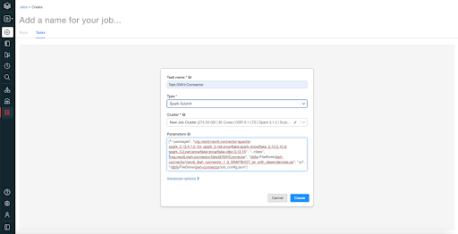
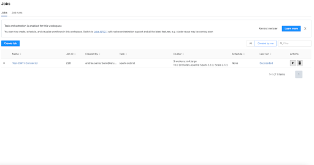

# Neo4j DWH Connector

This repository contains the Neo4j Data Warehouse Connector for Apache Spark.

# Goal

The goal of the Neo4j DWH Connector is to simplify the interoperability between Neo4j Spark and other data sources like Snowflake, Redshift and so on.

In order to do that we created this connector that via a simple JSON file creates Spark’s jobs through Spark Submit.

**Nota bene**

The examples that we’re providing here are for a Job that moves data from Snowflake to Neo4j but the DWH connector works also in the other way around.


# How does it work?

The Neo4j DWH Connector provides an easy way in order move data between Neo4j and popular Data Warehouses like:


* Snowflake
* BigQuery
* Redshift
* Azure Synapse

You can you use it in two ways:


* As Spark Submit Job by providing a JSON configuration that abstracts a Spark Job which moves data from one data source to another
* As Scala/Python API in order to simplify writing a Spark Job that moves the dat from a database to another


# How does the JSON configuration look like?

Following a very simple JSON that moves data from Snowflake to Neo4j.


## Nodes


```json
 {
   "name" : "Ingest Customer table as nodes into Neo4j",
   "conf" : { },
   "hadoopConfiguration" : { },
   "source" : {
     "format" : "snowflake",
     "options" : {
       "sfSchema" : "TPCH_SF1",
       "sfPassword" : "<omissis>",
       "sfUser" : "conker84",
       "dbtable" : "CUSTOMER",
       "sfDatabase" : "SNOWFLAKE_SAMPLE_DATA",
       "sfURL" : "https://<omissis>.snowflakecomputing.com"
     },
     "columns": [
       { "name": "CAST(C_ACCTBAL AS DOUBLE)", "alias": "C_ACCTBAL" },
       { "name": "C_ADDRESS" },
       { "name": "C_COMMENT" },
       { "name": "CAST(C_CUSTKEY AS LONG)", "alias": "C_CUSTKEY" },
       { "name": "C_MKTSEGMENT" },
       { "name": "C_NAME" },
       { "name": "CAST(C_NATIONKEY AS LONG)", "alias": "C_NATIONKEY" },
       { "name": "C_PHONE" }
     ],
     "where" : "C_CUSTKEY <= 10",
     "printSchema" : false,
     "partition" : {}
   },
   "target" : {
     "format" : "org.neo4j.spark.DataSource",
     "options" : {
       "url" : "neo4j+s://<omissis>.databases.neo4j.io",
       "authentication.basic.username" : "neo4j",
       "labels" : ":Customer",
       "authentication.basic.password" : "<omissis>"
     },
     "mode" : "Append"
   }
 }
```


This Job moves data from a Snowflake instance, and in particular from **SNOWFLAKE_SAMPLE_DATA** database, **TPCH_SF1** schema and table **CUSTOMER** into Neo4j database as nodes with label **Customer**.


## Relationships


```json
{
 "name" : "Ingest Order table as relationships into Neo4j",
 "conf" : { },
 "hadoopConfiguration" : { },
 "source" : {
   "format" : "snowflake",
   "options" : {
     "sfSchema" : "TPCH_SF1",
     "sfPassword" : "<omissis>",
     "sfUser" : "conker84",
     "dbtable" : "ORDERS",
     "sfDatabase" : "SNOWFLAKE_SAMPLE_DATA",
     "sfURL" : "https://<omissis>.snowflakecomputing.com"
   },
   "columns": [
     { "name": "CAST(O_CUSTKEY AS DOUBLE)", "alias": "O_CUSTKEY" },
     { "name": "O_ORDERDATE" },
     { "name": "O_COMMENT" },
     { "name": "CAST(O_ORDERKEY AS LONG)", "alias": "O_ORDERKEY" }
   ],
   "where" : "C_CUSTKEY <= 10",
   "printSchema" : false,
   "partition" : {}
 },
 "target" : {
   "format" : "org.neo4j.spark.DataSource",
   "options" : {
     "url" : "neo4j+s://<omissis>.databases.neo4j.io",
     "authentication.basic.username" : "neo4j",
     "authentication.basic.password" : "<omissis>",
     "relationship" : "HAS_ORDER",
     "relationship.save.strategy" : "keys",
     "relationship.source.save.mode" : "Overwrite",
     "relationship.source.labels" : ":Customer",
     "relationship.source.node.keys" : "O_CUSTKEY",
     "relationship.target.save.mode" : "Overwrite",
     "relationship.target.labels" : ":Order",
     "relationship.target.node.keys" : "O_ORDERKEY"
   },
   "mode" : "Overwrite"
 }
}
```


Output:




## Query

```json
{
 "name" : "Ingest Order table as relationships into Neo4j",
 "conf" : { },
 "hadoopConfiguration" : { },
 "source" : {
   "format" : "snowflake",
   "options" : {
     "sfSchema" : "TPCH_SF1",
     "sfPassword" : "<omissis>",
     "sfUser" : "conker84",
     "dbtable" : "ORDERS",
     "sfDatabase" : "SNOWFLAKE_SAMPLE_DATA",
     "sfURL" : "https://<omissis>.snowflakecomputing.com"
   },
   "columns": [
     { "name": "CAST(O_CUSTKEY AS DOUBLE)", "alias": "O_CUSTKEY" },
     { "name": "O_ORDERDATE" },
     { "name": "O_COMMENT" },
     { "name": "CAST(O_ORDERKEY AS LONG)", "alias": "O_ORDERKEY" }
   ],
   "where" : "C_CUSTKEY <= 10",
   "printSchema" : false,
   "partition" : {}
 },
 "target" : {
   "format" : "org.neo4j.spark.DataSource",
   "options" : {
     "url" : "neo4j+s://<omissis>.databases.neo4j.io",
     "authentication.basic.username" : "neo4j",
     "authentication.basic.password" : "<omissis>",
     "query" : "MERGE (s:Person:Customer{id: event.O_CUSTKEY}) MERGE(t:Order{id: event.O_ORDERKEY}) MERGE (s)-[:HAS_ORDER{date: event.O_ORDERDATE}]->(t)"
   },
   "mode" : "Overwrite"
 }
}
```

This Job moves data from a Snowflake instance, and in particular from **SNOWFLAKE_SAMPLE_DATA** database, **TPCH_SF1** 
schema and table **ORDERS** into Neo4j database as custom graph composed by the pattern
`(:Person:Customer)-[:HAS_ORDER]->(:Order)`.


## Fields Description

Following a detailed description of each field in the JSON configuration file:


* **name**: the job name. _It’s Optional_
* **master**: the spark master url, used only for internal testing purposes;
* **conf**: a set of key/value string pairs which will be applied to SparkConf. _It’s Optional_
* **hadoopConfiguration**: a set of key/value string pairs that will be applied to HadoopConfiguration. _It’s Optional_
* **source**, contains the information about the source Database (_it’s **Mandatory**_):
    * **format**: the format of the source Database (i.e. Snowflake, Neo4j, RedShift…). _It’s **Mandatory**_
    * **options**: a set of key/value pairs that contains the required configuration parameters for the selected format. Each option set is specifically related to the selected source **format**. For each one we’ll provide a set of links in the configuration stub in order to easily retrieve the correct configuration. _It’s **Mandatory**_
    * **columns**, a set of columns that you want to project, is useful in order to minimize the data movement from the source database; each column is composed of two fields (_It’s Optional_):
        * **name**: the name of the column. Consider that this field supports Spark SQL notation so you can manipulate the field like casting the field type, applying UDF to it and so on
        * **alias**: the name of the field if you want to rename it
    * **where**: a string that filters the data retrieved from the Database, you can use Spark SQL where condition in order to filter the data. _It’s Optional_
    * **limit**: limits the number of rows returned from the source data, it’s good for testing purposes. _It’s Optional_
    * **printSchema**: a boolean that prints the schema of the source data, useful for debugging. Default false
    * **partition**, is composed of two fields (_It’s Optional_):
        * **number**: the number of partitions
        * **by**: an optional parameter that defines the partition field
* **target**, contains the information about the target Database (_it’s **Mandatory**_):
    * **format**: the format of the target Database (i.e. Snowflake, Neo4j, RedShift…). _It’s **Mandatory**_
    * **options**: a set of key/value pairs that contains the required configuration parameters for the selected format. Each option set is specifically related to the selected target **format**. For each one we’ll provide a set of links in the configuration stub in order to easily retrieve the correct configuration. _It’s **Mandatory**_
    * **mode**, the Spark save mode, it’s specifically related to the selected target **format**._ It’s Optional;_

## Special values

In the JSON you can use special values that will be replaced at runtime with an actual value.
Currently we now support two special values:

* `${env:<ENV_PARAM_NAME>}` which checks for the parameter name and replace it with the actual value
* `${file:<FILE_PATH>}` which checks for the file replace it with the actual text content

This in order you let you keep the file cleanest as possibile

Consider this json:

```json
{
 "name" : "Ingest Order table as relationships into Neo4j",
 "conf" : { },
 "hadoopConfiguration" : { },
 "source" : {
   "format" : "snowflake",
   "options" : {
     "sfSchema" : "TPCH_SF1",
     "sfPassword" : "${env:SNOWFLAKE_PASSWORD}",
     "sfUser" : "${env:SNOWFLAKE_USER}",
     "dbtable" : "ORDERS",
     "sfDatabase" : "SNOWFLAKE_SAMPLE_DATA",
     "sfURL" : "${env:SNOWFLAKE_URL}"
   },
   "columns": [
     { "name": "CAST(O_CUSTKEY AS DOUBLE)", "alias": "O_CUSTKEY" },
     { "name": "O_ORDERDATE" },
     { "name": "O_COMMENT" },
     { "name": "CAST(O_ORDERKEY AS LONG)", "alias": "O_ORDERKEY" }
   ],
   "where" : "C_CUSTKEY <= 10",
   "printSchema" : false,
   "partition" : {}
 },
 "target" : {
   "format" : "org.neo4j.spark.DataSource",
   "options" : {
     "url" : "${env:NEO4J_URL}",
     "authentication.basic.username" : "${env:NEO4J_USER}",
     "authentication.basic.password" : "${env:NEO4J_PASSWORD}",
     "query" : "${file:/tmp/my_cypher_query.cyp}"
   },
   "mode" : "Overwrite"
 }
}
```

Consider that you have the following env variables:

* export SNOWFLAKE_USER=snowflake_foo
* export SNOWFLAKE_PASSWORD=snowflake_bar
* export SNOWFLAKE_URL=https://foo_bar.snowflakecomputing.com
* export NEO4J_USER=neo4j_foo
* export NEO4J_PASSWORD=neo4j_bar
* export NEO4J_URL=neo4j+s://foo_bar.databases.neo4j.io

And the content of `/tmp/my_cypher_query.cyp` is:

`CREATE (p:Person{id: event.id, fullName: event.full_name})`

The connector will replace the value as if you pass the following json:

Consider this json:

```json
{
 "name" : "Ingest Order table as relationships into Neo4j",
 "conf" : { },
 "hadoopConfiguration" : { },
 "source" : {
   "format" : "snowflake",
   "options" : {
     "sfSchema" : "TPCH_SF1",
     "sfPassword" : "snowflake_bar",
     "sfUser" : "snowflake_foo",
     "dbtable" : "ORDERS",
     "sfDatabase" : "SNOWFLAKE_SAMPLE_DATA",
     "sfURL" : "https://foo_bar.snowflakecomputing.com"
   },
   "columns": [
     { "name": "CAST(O_CUSTKEY AS DOUBLE)", "alias": "O_CUSTKEY" },
     { "name": "O_ORDERDATE" },
     { "name": "O_COMMENT" },
     { "name": "CAST(O_ORDERKEY AS LONG)", "alias": "O_ORDERKEY" }
   ],
   "where" : "C_CUSTKEY <= 10",
   "printSchema" : false,
   "partition" : {}
 },
 "target" : {
   "format" : "org.neo4j.spark.DataSource",
   "options" : {
     "url" : "neo4j+s://foo_bar.databases.neo4j.io",
     "authentication.basic.username" : "neo4j_foo",
     "authentication.basic.password" : "neo4j_bar",
     "query" : "CREATE (p:Person{id: event.id, fullName: event.full_name})"
   },
   "mode" : "Overwrite"
 }
}
```


# Use the DWH Connector as Spark Submit Job

The provided jar can be used in two ways:


1. In order to generate the configuration stub for the selected Source/Target databases
2. Launch the Spark Job

So when you want to move the data from a selected Source to a defined Target you need to perform the following steps:


1. Prepare the JSON file with all the required configurations with the Source and the Target database
2. Launch the Spark Job

If you, want to get the full list of available options you can use the following command:


```bash
java -jar neo4j-dwh-connector-<version>.jar -h
```




## Generate the configuration stub

You can generate the configuration file in a very simple way by running the following command:


```bash
java -jar neo4j-dwh-connector-<version>.jar -c -s <Source Database> -t <Target Database> -p <Where to put the configuration json file>
```


Example, generate a stub for a job that moves data from **Snowflake** to **Neo4j** and put the configuration into **/tmp/dwh_job_config.json**:


```bash
java -jar neo4j-dwh-connector-1.0.0.jar -c -s Snowflake -t Neo4j -p /tmp/dwh_job_config.json
```


## Launch the Spark Job

Once you configured the JSON file properly, in order to get the job done, you only need to launch the Spark Job.

**_Nota bene_**

Each selected Source/Target will require external dependencies in oder work. So please consider to add them.


### Launch the Spark Job from CLI via Spark Submit

In order to launch the Spark Job you need to place yourself into the Spark directory and run a command like this:


```bash
./bin/spark-submit \
  --class org.neo4j.dwh.connector.Neo4jDWHConnector \
  --packages <required dependecies> \
  --master spark://<SPARK_IP>:<SPARK_PORT> \
  --deploy-mode cluster \
  --supervise \
  --executor-memory 20G \
  --total-executor-cores 100 \
  /path/to/neo4j-dwh-connector-<version>.jar \
  -p /path/to/dwh_job_config.json
```


Example launch the a Spark Job that moves data from Snowflake to Neo4j:


```bash
./bin/spark-submit \
  --class org.neo4j.dwh.connector.Neo4jDWHConnector \
  --packages org.neo4j:neo4j-connector-apache-spark_2.12:4.1.0_for_spark_3,net.snowflake:spark-snowflake_2.12:2.10.0-spark_3.2,net.snowflake:snowflake-jdbc:3.13.15 \
  --master local
  /path/to/neo4j-dwh-connector-1.0.0-SNAPSHOT.jar \
  -p /path/to/dwh_job_config.json
```


### Launch the Spark Job from Databricks Cloud

Before creating the Spark Job you need to import the DWH connector jar and the JSON config [into DBFS](https://docs.databricks.com/data/data.html#:~:text=Import%20data,-If%20you%20have&text=There%20are%20two%20ways%20to,box%20on%20the%20landing%20page.)

In order to create a Spark Job into Databricks cloud you have to click into the **Jobs** menu section


and then on **Create Job**



This will open a the Job creation section:



where you need to define:

* the task name
* the type of the task, please select **Spark Submit**
* the cluster
* the parameters which are related to the required dependencies and the DWH job configuration

In particular for our Spark Job that moves data from Snowflake into Neo4j you need to apply these parameters:


```json
["--packages", "org.neo4j:neo4j-connector-apache-spark_2.12:4.1.2_for_spark_3,net.snowflake:spark-snowflake_2.12:2.10.0-spark_3.2,net.snowflake:snowflake-jdbc:3.13.15", "--class", "org.neo4j.dwh.connector.Neo4jDWHConnector", "dbfs:/FileStore/dwh-connector/neo4j_dwh_connector_1_0_SNAPSHOT_jar_with_dependencies.jar", "-p", "/dbfs/FileStore/dwh-connector/job_config.json"]
```


Once create you’ll have the find it in your Job list as shown here:



In order to start it you just need to press the play button in the Actions sections.


# Use the DWH Connector via Scala APIs

You can also use the connector in a notebook for instance leveraging the Scala APIs in very convenient way like this:

```scala

import org.neo4j.dwh.connector.Neo4jDWHConnector
import org.neo4j.dwh.connector.domain._


// the source database configuration
val source = Source(
  format = "snowflake", // the source database (mandatory)
  // the configuration options it will change for every source database (mandatory)
  options = Map(
    "sfSchema" -> "TPCH_SF1",
    "sfPassword" -> "<**>",
    "sfUser" -> "<**>",
    "dbtable" -> "CUSTOMER",
    "sfDatabase" -> "SNOWFLAKE_SAMPLE_DATA",
    "sfURL" -> "https://<**>.eu-central-1.snowflakecomputing.com"
  ),
  // a list of selected projected columns, it can be useful in order to eventually cast data, 
  // apply Spark's UDFs and minimize the data movement from the source database (optional)
  columns = Seq(
    Column(name = "CAST(C_ACCTBAL AS DOUBLE)", alias = "C_ACCTBAL"),
    Column(name = "C_ADDRESS"),
    Column(name = "C_COMMENT"),
    Column(name = "CAST(C_CUSTKEY AS LONG)", alias = "C_CUSTKEY"),
    Column(name = "C_MKTSEGMENT"),
    Column(name = "C_NAME"),
    Column(name = "CAST(C_NATIONKEY AS LONG)", alias = "C_NATIONKEY"),
    Column(name = "C_PHONE")
  ),
  where = "", // a filter for the source dataset (optional)
  printSchema = true, // if you want to print the schema, useful for debug purposes (optional)
  show = 5, // if you want show the source database, useful for debug purposes (optional)
  limit = 10, // the amount of rows that you want to have from the source dataset (optional)
  // a dataframe partition configuration (optional)
  partition = Partition(
    number = -1, // the number of partions mandatory if you want to define partitions
    by = "" // the field to partition (optional)
  )
)

// the target database configuration
val target = Target(
  format = "org.neo4j.spark.DataSource", // the target database (mandatory)
  // the configuration options it will change for every source database (mandatory)
  options = Map(
    "labels" -> ":Person:Customer",
    "url" -> "neo4j+s://<**>.databases.neo4j.io",
    "authentication.basic.username" -> "neo4j",
    "authentication.basic.password" -> "<**>",
    "node.keys" -> "C_CUSTKEY"
  ),
  mode = "Overwrite"
)

val config = JobConfig(
  name = "The name of the Spark Job",
  conf = Map.empty, // a <String,String> configuration map, every k/v binding will be insert as Spark Configuration
  hadoopConfiguration = Map.empty, // a <String,String> configuration map, every k/v binding will be insert as Hadoop Configuration
  source = source,
  target = target
)

val connector = new Neo4jDWHConnector(sparkSession, config)

// this will ingest the data from source to target database
connector.run()
```

# Use DWH Connector via Python APIs

You can also use the connector in a notebook for instance leveraging the Python APIs in very convenient way like this:

```python
from neo4j_dwh_connector import *

source = Source(
    format="snowflake",  # the source database (mandatory)
    # the configuration options it will change for every source database (mandatory)
    options={
        "sfSchema": "TPCH_SF1",
        "sfPassword": "****",
        "sfUser": "****",
        "dbtable": "CUSTOMER",
        "sfDatabase": "SNOWFLAKE_SAMPLE_DATA",
        "sfURL": "https://****.eu-central-1.snowflakecomputing.com"
    },
    # a list of selected projected columns, it can be useful in order to eventually cast data,
    # apply Spark's UDFs and minimize the data movement from the source database (optional)
    columns=[
        Column(name="CAST(C_ACCTBAL AS DOUBLE)", alias="C_ACCTBAL"),
        Column(name="C_ADDRESS"),
        Column(name="C_COMMENT"),
        Column(name="CAST(C_CUSTKEY AS LONG)", alias="C_CUSTKEY"),
        Column(name="C_MKTSEGMENT"),
        Column(name="C_NAME"),
        Column(name="CAST(C_NATIONKEY AS LONG)", alias="C_NATIONKEY"),
        Column(name="C_PHONE")
    ],
    where="",  # a filter for the source dataset (optional)
    printSchema=True,  # if you want to print the schema, useful for debug purposes (optional)
    show=5,  # if you want show the source database, useful for debug purposes (optional)
    limit=10,  # the amount of rows that you want to have from the source dataset (optional)
    # a dataframe partition configuration (optional)
    partition=Partition(
        number=-1,  # the number of partions mandatory if you want to define partitions
        by=""  # the field to partition (optional)
    )
)
# the target database configuration
target = Target(
    format="org.neo4j.spark.DataSource",  # the target database (mandatory)
    # the configuration options it will change for every source database (mandatory)
    options={
        "labels": ":PersonNew1:CustomerNew1",
        "url": "neo4j+s://****.databases.neo4j.io",
        "authentication.basic.username": "neo4j",
        "authentication.basic.password": "****",
        "node.keys": "C_CUSTKEY"
    },
    mode="Overwrite"
)

config = JobConfig(
    name="The name of the Spark Job",
    conf={},  # a <String,String> configuration dict, every k/v binding will be insert as Spark Configuration
    hadoopConfiguration={},
    # a <String,String> configuration dict, every k/v binding will be insert as Hadoop Configuration
    source=source,
    target=target
)

connector = Neo4jDWHConnector(sparkSession, config)

# this will ingest the data from source to target database
connector.run()
```

# Supported Spark versions

We support:

* Spark 2.4 with Scala 2.11 and 2.12
* Spark 3.x with Scala 2.12 and 2.13

# Maven resolution

It depends on the Spark and Scala version:
* For Spark 2.4 with Scala 2.11 and 2.12 the package resolution is `org.neo4j:neo4j-dwh-connector_<scala_version>:<dwh-connector-version>_for_spark_2.4`
* For Spark 3.x with Scala 2.12 and 2.13 the package resolution is `org.neo4j:neo4j-dwh-connector_<scala_version>:<dwh-connector-version>_for_spark_3`


# Build it locally

In order to build it locally you can use the following commands

For scala 2.11 and Spark 2.4 `./maven-release.sh package 2.11 2.4`

For scala 2.12 and Spark 2.4 `./maven-release.sh package 2.12 2.4`

For scala 2.12 and Spark 3 `./maven-release.sh package 2.12 3`

For scala 2.13 and Spark 3 `./maven-release.sh package 2.13 3`

#Blog Guidance
Here comes the details for Make easier than ever to move data between your data warehouse and Neo4j!

https://neo4j.com/developer-blog/introducing-neo4j-data-warehouse-connector/

# Quickstart

If you want to see how you can leverage Scala and Python APIs you can download:

* a [Databricks notebook](doc/notebooks/Neo4j%20DWH%20Connector%20quickstart.html) ready to be imported into the Databricks cloud environment 
